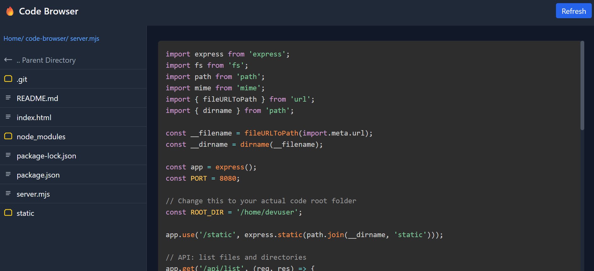

# 🗂️ Code Browser

A simple, elegant, self-hosted web-based file explorer with syntax highlighting — perfect for browsing and sharing your code directory.

 <!-- Optional: Add your own screenshot -->

---

## 🚀 Features

- 🧠 Syntax highlighting powered by [Prism.js](https://prismjs.com/)
- 💡 Clean & responsive UI
- 📁 Recursive folder navigation
- 🌐 Simple Node.js + Express server
- 🐳 Docker support

---

## 🔧 Manual Installation

1. **Clone the repo:**

   ```bash
   git clone https://github.com/0wardriver0/code-browser.git
   cd code-browser
   ---
   npm install
   ---
   node server.mjs

## Docker Install

2. **build the image**

   ```bash
   docker build -t code-browser .
   ---
   docker run -d \
   --name code-browser \
   -p 8080:8080 \
   -v /path/to/your/code:/path/to/your/code \  <!-- both should reflect the same path, delete this line -->
   code-browser

   then - http://<ip>:3000

## File Structure

   ```bash
   code-browser/
   ├── public/
   │   ├── css/
   │   ├── js/
   │   └── index.html
   ├── server.js
   ├── package.json
   ├── Dockerfile


